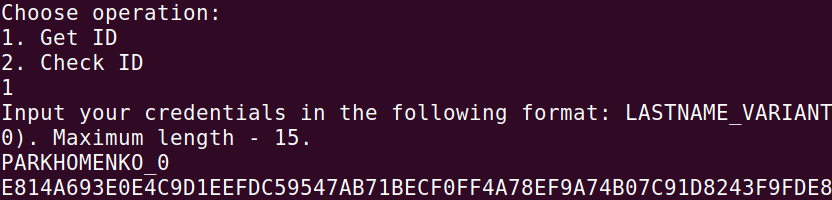
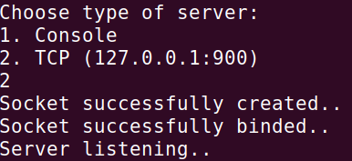
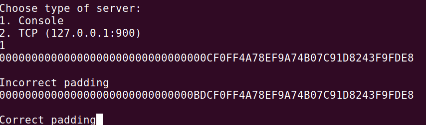

# Padding-oracle-attack
1. Программа на основе имени генерирует строку длиной 32 байта(2 блока), которую впоследствии шифрует используя некоторый секретный ключ.
 
2. Подключаемся к серверу:  

3. Выполняем перебор, начиная с последнего байта первого блока. Пользуемся ответами сервера:  

4. Суммируем по модулю 2 IV и перевернутый итоговый массив. Получаем ответ:
<blockquote>
print (' '.join(chr(i) for i in answer))  
| h d l j n d l a l n n u `  
</blockquote>
<blockquote>
hexAnswer = [hex(i) for i in answer]  
print(hexAnswer)  
['0x7c', '0x68', '0x64', '0x6c', '0x6a', '0x6e', '0x64', '0x6c', '0x61', '0x6c', '0x6e', '0x6e', '0x75', '0x60', '0x2', '0x2']
</blockquote>

[Подробнее](https://blog.gdssecurity.com/labs/2010/9/14/automated-padding-oracle-attacks-with-padbuster.html)  
[Коротко про атаку](https://robertheaton.com/2013/07/29/padding-oracle-attack/)

P.S. Несмотря на нечитабельный ответ, программа работает верно.

